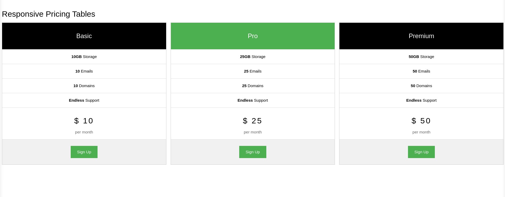
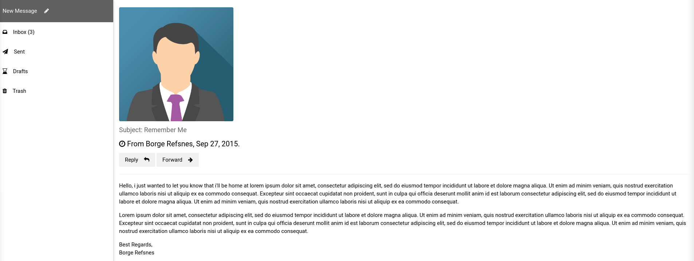

# Bônus do Feriadão: HTML, CSS e JavaScript
Boas-vindas ao repositório Bônus do Feriadão! Criamos este repositório para que você possa manter o ritmo de estudo dos conteúdos passados até o momento mesmo que não tenhamos atividades aqui na Trybe. 

Aqui você encontrará algumas indicações de materiais e  exercícios para continuar praticando o que aprendeu e se desafiando! 

:warning: Você não precisa clonar este repositório. :warning:

Esperamos que você goste do que preparamos aqui e aproveite o conteúdo! #vqv :rocket:

## Sumário
- [Bônus do Feriadão: HTML, CSS e JavaScript](#bônus-do-feriadão-html-css-e-javascript)
  - [Sumário](#sumário)
  - [Conteúdos extras: HTML e CSS :sunglasses:](#conteúdos-extras-html-e-css-sunglasses)
    - [Conteúdo em texto :computer:](#conteúdo-em-texto-computer)
    - [Conteúdo em vídeo :computer:](#conteúdo-em-vídeo-computer)
  - [Conteúdos extras: JavaScript](#conteúdos-extras-javascript)
    - [Conteúdo em texto :computer:](#conteúdo-em-texto-computer-1)
    - [Conteúdo em vídeo :computer:](#conteúdo-em-vídeo-computer-1)
  - [Exercícios :runner:](#exercícios-runner)
    - [Exercício 1 - HTML e CSS](#exercício-1---html-e-css)
      - [Dicas](#dicas)
    - [Exercício 2 - HTML e CSS](#exercício-2---html-e-css)
      - [Dicas](#dicas-1)
    - [Exercício 3 - HTML e CSS](#exercício-3---html-e-css)
      - [Dicas](#dicas-2)
    - [Exercício 4 - JavaScript](#exercício-4---javascript)
  - [Bônus do bônus: Git e GitHub :smirk_cat:](#bônus-do-bônus-git-e-github-smirk_cat)
    - [Conteúdo em texto :octopus:](#conteúdo-em-texto-octopus)
    - [Conteúdo em vídeo :octopus:](#conteúdo-em-vídeo-octopus)
  - [Suas melhores amigas: Documentações :green_heart:](#suas-melhores-amigas-documentações-green_heart)

## Conteúdos extras: HTML e CSS :sunglasses:
Selecionamos alguns conteúdos extras de HTML e CSS para você consultar que podem te ajudar a revisar a matéria vista até esse momento. Os materiais são tanto textos quanto vídeos para atender os diversos estilos de aprendizagem. 

### Conteúdo em texto :computer:
No nosso blog temos uma série de tutoriais de HTML e CSS que podem ser interessantes para você revisar e aprender algumas coisas novas:

:pushpin: <a href="https://blog.betrybe.com/html/" target="_blank"> HTML </a>

:pushpin: <a href="https://blog.betrybe.com/css/" target="_blank"> CSS </a>

Selecionamos também um conteúdo sobre HTML semântico que pode ajudar você, além de uma série que vai te ensinar a como usar CSS sem chutar. 

:pushpin: <a href="https://www.devmedia.com.br/html-semantico-conheca-os-elementos-semanticos-da-html5/38065" target="_blank"> HTML Semântico </a>

:pushpin: <a href="https://medium.com/collabcode/pare-de-chutar-e-aprenda-as-propriedades-css-de-posicionamento-603154655121" target="_blank"> Primeiro Pare de chutar e aprenda CSS </a>

### Conteúdo em vídeo :computer:
Aqui selecionamos alguns vídeos do YouTube também sobre HTML e CSS. Eles estão separados por tema em ordem cronológica, ou seja, você pode assistir do primeiro da lista até o último que fará total sentido. Ou então, pode assistir apenas aqueles que interessarem mais. :wink:

:pushpin: <a href="https://www.youtube.com/watch?v=E6CdIawPTh0&list=PLHz_AreHm4dkZ9-atkcmcBaMZdmLHft8n&index=13" target="_blank"> Primeiro código em HTML </a>

:pushpin: <a href="https://www.youtube.com/watch?v=f6NTJdtEFOc&list=PLHz_AreHm4dkZ9-atkcmcBaMZdmLHft8n&index=14" target="_blank"> Paragrafos e quebras </a>

:pushpin: <a href="https://www.youtube.com/watch?v=CwOmEetWMnU&list=PLHz_AreHm4dkZ9-atkcmcBaMZdmLHft8n&index=18" target="_blank"> Tag img </a>

:pushpin: <a href="https://www.youtube.com/watch?v=aiOEBhozEOg&list=PLHz_AreHm4dkZ9-atkcmcBaMZdmLHft8n&index=21" target="_blank"> Hierarquia de títulos </a>

:pushpin: <a href="https://www.youtube.com/watch?v=HaSgt1hK2Fs&list=PLHz_AreHm4dkZ9-atkcmcBaMZdmLHft8n&index=21" target="_blank"> HTML Semântico </a>

:pushpin: <a href="https://www.youtube.com/watch?v=JlE0pzESf5g&list=PLHz_AreHm4dkZ9-atkcmcBaMZdmLHft8n&index=25" target="_blank"> Listas </a>

:pushpin: <a href="https://www.youtube.com/watch?v=LeOVXQDsAIY&list=PLHz_AreHm4dkZ9-atkcmcBaMZdmLHft8n&index=27" target="_blank"> Âncoras </a>

:pushpin: <a href="https://www.youtube.com/watch?v=LeLnlT-ZKw8&list=PLHz_AreHm4dkZ9-atkcmcBaMZdmLHft8n&index=28" target="_blank"> Links internos </a>

:pushpin: <a href="https://www.youtube.com/watch?v=NGfPXJGiNH8&list=PLHz_AreHm4dlUpEXkY1AyVLQGcpSgVF8s&index=13" target="_blank"> Tamanho de fontes e suas medidas </a>

:pushpin: <a href="https://www.youtube.com/watch?v=FLuQonci9wU&list=PLHz_AreHm4dlUpEXkY1AyVLQGcpSgVF8s&index=14" target="_blank"> Google fontes </a>

:pushpin: <a href="https://www.youtube.com/watch?v=tJTtp4qyqdE&list=PLHz_AreHm4dlUpEXkY1AyVLQGcpSgVF8s&index=18" target="_blank"> Alinhamento de textos </a>

:pushpin: <a href="https://www.youtube.com/watch?v=TZuVpJmSNSE&list=PLHz_AreHm4dlUpEXkY1AyVLQGcpSgVF8s&index=19" target="_blank"> Usando ids </a>

:pushpin: <a href="https://www.youtube.com/watch?v=zXfTjPrMC_0&list=PLHz_AreHm4dlUpEXkY1AyVLQGcpSgVF8s&index=20" target="_blank"> Usandos ids e classes </a>

:pushpin: <a href="https://www.youtube.com/watch?v=WPtRX4n0UJs&list=PLHz_AreHm4dlUpEXkY1AyVLQGcpSgVF8s&index=21" target="_blank"> Pseudoclasses </a>

:pushpin: <a href="https://www.youtube.com/watch?v=vMlrcOVr7po&list=PLHz_AreHm4dlUpEXkY1AyVLQGcpSgVF8s&index=22" target="_blank"> Pseudo-elementos </a>

:pushpin: <a href="https://www.youtube.com/watch?v=3ZFYXkzXhqE&list=PLHz_AreHm4dlUpEXkY1AyVLQGcpSgVF8s&index=23" target="_blank"> Modelo de caixas </a>

:pushpin: <a href="https://www.youtube.com/watch?v=rXF1okX0v9E&list=PLHz_AreHm4dlUpEXkY1AyVLQGcpSgVF8s&index=24" target="_blank"> Modelo de caixas pt 1 </a>

:pushpin: <a href="https://www.youtube.com/watch?v=-CPoDvZLQ6k&list=PLHz_AreHm4dlUpEXkY1AyVLQGcpSgVF8s&index=25" target="_blank"> Modelo de caixas pt 2 </a>

:pushpin: <a href="https://www.youtube.com/watch?v=JACiDRNWjjQ&list=PLHz_AreHm4dlUpEXkY1AyVLQGcpSgVF8s&index=27" target="_blank"> Sombra </a>

:pushpin: <a href="https://www.youtube.com/watch?v=PGIrTzQqpqo&list=PLHz_AreHm4dlUpEXkY1AyVLQGcpSgVF8s&index=28" target="_blank"> Bordas arredondadas </a>

:pushpin: <a href="https://www.youtube.com/watch?v=n0rjAs_Im4w&list=PLHz_AreHm4dlUpEXkY1AyVLQGcpSgVF8s&index=29" target="_blank"> Bordas decoradas </a>

## Conteúdos extras: JavaScript 
Selecionamos alguns conteúdos extras de HTML e CSS para você consultar que podem te ajudar a revisar a matéria vista até esse momento. Os materiais são tantp textos quanto vídeos para atender os diversos estilos de aprendizagem.

### Conteúdo em texto :computer:
A seguir, alguns conteúdos em texto para você explorar. 

:pushpin: <a href="https://developer.mozilla.org/pt-BR/docs/Learn/Getting_started_with_the_web/JavaScript_basics" target="_blank"> JavaScript Básico </a>

:pushpin: <a href="https://www.devmedia.com.br/javascript-tutorial/37257" target="_blank"> JavaScript Tutorial </a>

:pushpin: <a href="https://ricardo-reis.medium.com/javascript-be48d8f23451" target="_blank"> Tutoriais de JavaScript (instalação de editores de texto, console, tipos de dados, funções e etc.) </a>

### Conteúdo em vídeo :computer:
No nosso curso introdutório temos uma série de conteúdos em vídeo que poderão servir para revisar alguns conceitos vistos em nossa primeira aula de JavaScript. 

:pushpin: <a href="https://www.youtube.com/watch?v=KG1uwe6QnSQ&list=PLP6Z8YhN_d5RpQwAMZLALAO7neDy7ypCA&index=2" target="_blank"> Variáveis e constantes </a>

:pushpin: <a href="https://www.youtube.com/watch?v=a1NiHwH9clE&list=PLP6Z8YhN_d5RpQwAMZLALAO7neDy7ypCA&index=4" target="_blank"> Tipos primitivos </a>

:pushpin: <a href="https://www.youtube.com/watch?v=wkradRZd93g&list=PLP6Z8YhN_d5RpQwAMZLALAO7neDy7ypCA&index=5" target="_blank"> Operadores aritméticos </a>

:pushpin: <a href="https://www.youtube.com/watch?v=hoPy34YaR4U&list=PLP6Z8YhN_d5RpQwAMZLALAO7neDy7ypCA&index=7" target="_blank"> Operadores de comparação </a>

:pushpin: <a href="https://www.youtube.com/watch?v=ivGxVPnWSCA&list=PLP6Z8YhN_d5RpQwAMZLALAO7neDy7ypCA&index=7" target="_blank"> Operadores Lógicos </a>

:pushpin: <a href="https://www.youtube.com/watch?v=JANN0a-o95w&list=PLP6Z8YhN_d5RpQwAMZLALAO7neDy7ypCA&index=8" target="_blank"> Estruturas Condicionais </a>

:pushpin: <a href="https://www.youtube.com/watch?v=defBuY0nLrc&list=PLP6Z8YhN_d5RpQwAMZLALAO7neDy7ypCA&index=9" target="_blank"> Arrays </a>
## Exercícios :runner:
Agora que você já consumiu os conteúdos, que tal fazer alguns exercícios para praticar aquilo que revisou e aprendeu?

Sabemos que uma das melhores formas de aprender um conteúdo novo é praticar, praticar e praticar!!! 

Porém, melhor ainda é quando nós ensinamos alguém ou trabalhamos em equipe para resolver um problema. Que tal chamar uma ou duas pessoas para fazer os exercícios com você? :wink:

:warning: Esses exercícios são baseados em templates demo do site ```W3 Schools``` (<a href="https://www.w3schools.com/w3css/w3css_templates.asp" target="_blank"> acesse aqui </a>). :warning:

### Exercício 1 - HTML e CSS
Neste exercício, você deve replicar a tela mostrada na imagem a seguir: 



#### Dicas 
1. Você provavelmente já identificou que precisará de alguns containers para reproduzir essa imagem; 
2. Utilize tags semânticas para praticar;
3. No seu CSS, terá que trabalhar com posicionamento desses containers para colocá-los um ao lado do outro; 
4. O código de cor do tom de verde da imagem é: #4CAF50, mas você pode usar as cores que quiser.

### Exercício 2 - HTML e CSS
Neste exercício, você deve replicar a tela mostrada na imagem a seguir: 



#### Dicas
1. Neste exercício, você pode adicionar uma imagem qualquer para representar a foto de perfil; 
2. Os containers aqui também poderão facilitar o posicionamento dos elementos na tela; 
3. Use tags semânticas para praticar; 
4. Você pode buscar os ícones em sites que os disponibilizam gratuitamente. 

### Exercício 3 - HTML e CSS
Neste exercício, um pouco mais desafiador, você deve replicar a tela mostrada na imagem a seguir: 


#### Dicas
1. Nesse exercício, você pode utilizar sua própria foto e suas informações para criar esse exemplo de currículo; 
2. Use tags semânticas para praticar.

### Exercício 4 - JavaScript
Neste exercício, vamos usar o repositório de <a href="https://github.com/tryber/exercises-programming-logic-challenges" target="_blank"> Lógica de Programação </a>

Você deverá seguir o passo a passo a seguir para fazer os exercícios: 

1. Clone o repositório: ```git clone git@github.com:tryber/exercises-programming-logic-challenges.git```;
2. Procure a pasta ```Desafios```. Dentro dessa pasta, você verá uma série de outras pastas. Nós vamos fazer alguns exercícios de ```Operadores Aritméticos``` e ```Estruturas Condicionais```;
3. Em ```Operadores Aritméticos```, fazer os exercícios de 1 (```desafio-operadores-aritmeticos-01.js```) a 10 (```desafio-operadores-aritmeticos-010.js```);
4. Em ```Estruturas Condicionais```, fazer exercísios de 1 a 5.

:warning: Você não precisa dar push neste repositório. :warning:

## Bônus do bônus: Git e GitHub :smirk_cat:
Você que está com dificuldades com Git e GitHub achou que não ia ter conteúdo extra sobre esse tema? Achou errado! 

### Conteúdo em texto :octopus:

:pushpin: <a href="https://blog.betrybe.com/tecnologia/git-e-github/" target="_blank"> Git e GitHub: o que são, quais as diferenças e como usar na prática? </a>

:pushpin: <a href="https://tecnoblog.net/400821/como-usar-o-github-guia-para-iniciantes/" target="_blank"> Como usar o GitHub? </a>

:pushpin: <a href="https://gist.github.com/victorsenam/8580499" target="_blank"> Dicionário de Git e GitHub </a>

### Conteúdo em vídeo :octopus:

:pushpin: <a href="https://www.youtube.com/watch?v=DqTITcMq68k" target="_blank"> O que é Git e GitHub? </a>

:pushpin: <a href="https://www.youtube.com/watch?v=UBAX-13g8OM" target="_blank"> Como usar Git e GitHub na prática! </a>

:pushpin: <a href="https://www.youtube.com/watch?v=TsaLQAetPLU" target="_blank"> Como personalizar seu perfil do GitHub? </a>

:pushpin: <a href="https://trybecourse.slack.com/archives/C02EZT1EJSY/p1632961992397100" target="_blank"> Trabalhando em grupo com GitHub </a>

## Suas melhores amigas: Documentações :green_heart:

:star2: <a href="https://developer.mozilla.org/pt-BR/docs/Web/HTML" target="_blank"> HTML </a>

:star2: <a href="https://developer.mozilla.org/pt-BR/docs/Web/CSS" target="_blank"> CSS </a>

:star2: <a href="https://developer.mozilla.org/pt-BR/docs/Web/JavaScript" target="_blank"> JavaScript </a>

:star2: <a href="https://docs.github.com/pt" target="_blank"> GitHub </a>
